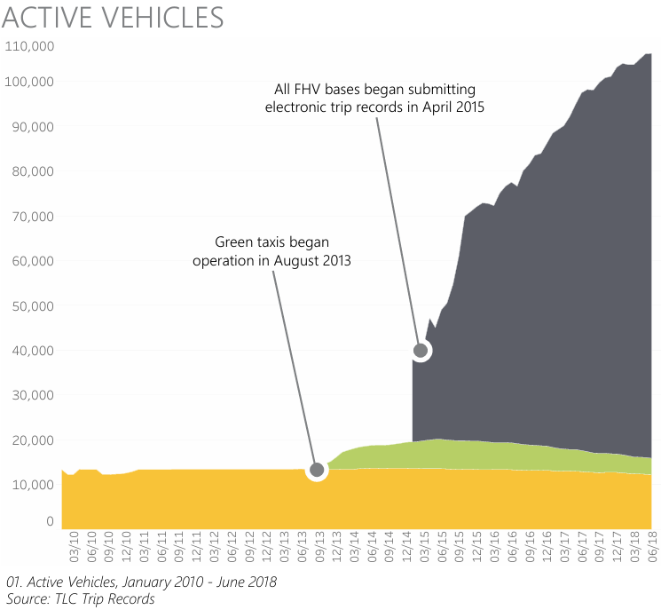

# NYC-TLC-Green-Taxis

# Background Understanding

**The New York City Taxi and Limousine Commission (TLC)**, created in 1971, is the agency responsible **for licensing and regulating** New York City's medallion (yellow) taxis, street hail livery (green) taxis, for-hire vehicles (FHVs), commuter vans, and paratransit vehicles. The TLC collects trip record information for each taxi and for-hire vehicle trip completed by their licensed drivers and vehicles. They receive taxi trip data from the technology service providers (TSPs) that provide electronic metering in each cab, and FHV trip data from the app, community livery, black car, or luxury limousine company, or base, who dispatched the trip. In each trip record dataset, one row represents a single trip made by a TLC-licensed vehicle.

**Green taxis**, also known as **boro taxis** and **street-hail liveries**, were introduced in August of 2013 **to improve taxi service and availability in the boroughs**. Green taxis may respond to street hails, but only in the areas indicated in green on the map (i.e. above W 110 St/E 96th St in Manhattan and in the boroughs). They cannot pick up passengers at airports unless the trips are pre-arranged through a base. SHLs are inspected twice per year, and drivers must pass a driver education course. Fares are set by the TLC on street hails and e-hails. the dispatching base sets the fare when service is pre-arranged.

In this scenario, **we will focus on this type of taxis (green).**

You can take a look at these e-book for more information.
- [Trip Record User Guide](https://www.nyc.gov/assets/tlc/downloads/pdf/trip_record_user_guide.pdf)
- [2020 TLC Factbook](https://www.nyc.gov/assets/tlc/downloads/pdf/2020-tlc-factbook.pdf)
- [2018 TLC Factbook](https://www.nyc.gov/assets/tlc/downloads/pdf/2018_tlc_factbook.pdf)

# Business Problem

At the first launch of green taxis in August 2013, it was smooth and looks promising. But it wasn't long until the launch of For-Hire Vehicle (FHV) or we can call it online taxis, that came in April 2015. The very first boro taxi driver gave her tought and experience while working as a driver in this segment for almost a decade. In the article she said **"We did the first two years very well, my colleagues were making money. But then everything went grim when the apps came in".** The city did not put limits on the number of app-based cars, known as for-hire vehicles, until 2018, when the TLC said there were more than 80,000 on city streets.

Looking at the [2018 TLC Factbook](https://www.nyc.gov/assets/tlc/downloads/pdf/2018_tlc_factbook.pdf). This book shows the overview and trend of the NYC TLC until the middle of year 2018. We can take a look at the active vehicle for each taxi types from 2010 to 2018. The green taxis have an uptrend until the launch of online taxis, affter that the trend going down. While the FHV (online taxis) trend is upwards and yellow taxis remain steadily.

The same goes to the number of licensed vehicles. Where the number of licensed green taxis were **decreased** by 36% in 2018 compared to two years before (2016).

 

As the number of green taxis goes down, the daily average trips of green taxis were having the same problem. For three consecutive year (2016, 2017, 2018) the daily average trips of green taxis were **decreased** over the years.

 

# Data Analysis Goals

As the demand for green taxis is decreased over the year. The easiest way is to change to an online taxi (FHV). But for some people that loves to work on their own schedule without affiliation to online taxis company. There's still a way out of this situation. By using the power of data, we will try to uncover a knowledge that hopefully can help green taxi drivers to maximize their potential. In this data analysis project, **we will use data of green taxi operations that populated in the month of January 2023**. You can download the dataset using [this link](https://d37ci6vzurychx.cloudfront.net/trip-data/green_tripdata_2023-01.parquet).

By delving deeper into specific aspects of taxi operations, we can uncover some truth that can provide a beneficial information for green taxi drivers. In this analysis we want to figure out the demand based on the region (borough & zone) and time. Hopefully this can tailor green taxi drivers in order to find their potential customers.

The main goal is to provide insights to green taxi drivers or any other stakeholders that can assist in their strategy and decision-making by knowing the right place and the right moment. Here are several things that we want to know by looking at the data:
1. Which borough have the most total trips and revenue?
2. How is the distribution of trips and revenue in each borough?
3. How are the daily, weekly, and hourly trends/patterns of total trips?

Aside from the main goal, here we will try to uncover any **hidden information by drilling through the data into a very specific parts.**

[Dashboard link](https://public.tableau.com/views/Book1_17173972444820/InteractiveDashboard?:language=en-US&publish=yes&:sid=&:display_count=n&:origin=viz_share_link)
 [Tableau Story link](https://public.tableau.com/views/NYCTLCGreenTaxis/Story1?:language=en-US&:sid=&:display_count=n&:origin=viz_share_link)
